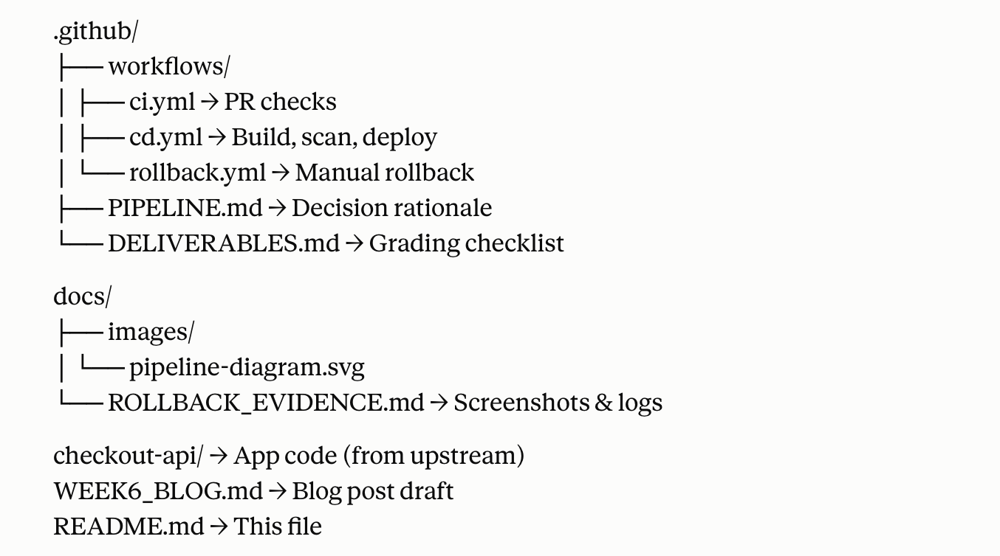

# FreshCart Week 6: CI/CD Pipeline & Automated Deployment

## Overview

A GitHub Actions pipeline automating build, test, security scan, and multi-environment deployment for FreshCart's checkout API. Includes staging approval gates, production review gates, and tested rollback procedures.

**Infrastructure**: GCP (Compute Engine, Cloud SQL), GitHub Actions, Docker Hub  
**Auth**: Workload Identity Federation (WIF) for short-lived credentials  
**Status**: ✅ Fully functional, rollback tested

## Quick Start

```bash
git clone https://github.com/Kabazbay/freshcart-week6.git
cd freshcart-week6

# View the pipeline
cat .github/workflows/cd.yml

# Manual rollback (if needed)
# 1. Go to https://github.com/Kabazbay/freshcart-week6/actions
# 2. Select "Rollback" workflow
# 3. Input image_tag (e.g., 52222e9) and environment (staging|production)
# 4. Run
```

## Pipeline Stages

### 1. CI (Pull Request)
**Trigger**: `on: pull_request`  
**Steps**: npm install (cached), build, typecheck  
**Outcome**: Blocks merge on failures

### 2. Build → Scan → Push (Main Merge)
**Trigger**: `on: [push: main]`  
**Steps**:
- Docker build (image tagged with commit SHA)
- Trivy scan (fails on CRITICAL or HIGH; warns on MODERATE in tooling)
- Push to Docker Hub via WIF

### 3. Deploy Staging (Automatic)
**Trigger**: On successful build-scan-push  
**Steps**: IAP SSH tunnel → `docker pull` → `docker run` → health check  
**Outcome**: Confirms image runs; catches runtime issues

### 4. Deploy Production (Approval Gate)
**Trigger**: Manual approval in GitHub environment  
**Steps**: Same as staging, targets same VM  
**Outcome**: Human review before production

### 5. Rollback (Manual)
**Trigger**: Workflow dispatch (any time)  
**Inputs**: `image_tag` (e.g., `52222e9`), `environment` (staging|production)  
**Steps**: IAP SSH → pull specified tag → docker run → health check  
**Outcome**: Instant recovery to any known-good tag

## Architecture


On failure/manual request:
     ↓
Rollback (workflow_dispatch)
Pull known-good tag, redeploy


## Key Decisions

**WIF over service account keys**: Tokens are short-lived and scoped to the GitHub repo only. No long-lived credentials stored in GitHub secrets.

**Scan on build, not on VM**: Security gates run before the image is pushed. CRITICAL/HIGH failures block the pipeline; MODERATE warnings in dev tooling (npm, not app code) are logged and accepted.

**Automatic staging, approval for production**: Staging proves the image runs. Production requires human confirmation after staging succeeds, catching last-minute issues and reducing rollback frequency.

**Approval gate as environment**: GitHub's `environment:` feature enforces mandatory reviewers. Deployment cannot proceed without explicit approval.

**Rollback as dispatch**: Manual, not automatic. Requires conscious decision (avoid thrashing between rollback/redeploy). Can target any prior tag.

## Rollback Test Results

**Broken deploy** (intentional): Attempted to deploy non-existent tag `52552m9`  
→ Docker pull failed: `manifest unknown`  
→ Deploy job exited 1

**Recovery**: Rolled back to `52222e9` (last known-good)  
→ Image pulled successfully  
→ Container started  
→ Health check: `{"status":"ok"}`  
→ App serving traffic  

**Conclusion**: Rollback mechanism works reliably under failure conditions.

## Files


## Metrics (DORA)

- **Lead time for changes**: ~4 min (commit to staging)
- **Change failure rate**: ↓ (Trivy scans + staging approval gate)
- **MTTR**: <2 min (rollback via dispatch)
- **Deployment frequency**: No longer limited by manual toil

## Next Steps

- [ ] Publish blog post to Medium
- [ ] Archive Week 6 repo (separate from Week 5)
- [ ] Week 7: Add production canary deployment
- [ ] Week 8: Multi-environment config (dev/staging/prod)

## Resources

- **Workload Identity Federation**: https://cloud.google.com/docs/authentication/workload-identity-federation
- **GitHub Environments**: https://docs.github.com/en/actions/deployment/targeting-different-environments
- **Trivy**: https://github.com/aquasecurity/trivy
- **Blog post**: See `WEEK6_BLOG.md` and https://medium.com/@kabazbay98/i-automated-freshcarts-deploy-process-then-broke-it-on-purpose-to-test-the-rollback-6fab2a5629b2


## Author

Akintomiwa 
Learn Cloud with Amina, Week 6 Capstone